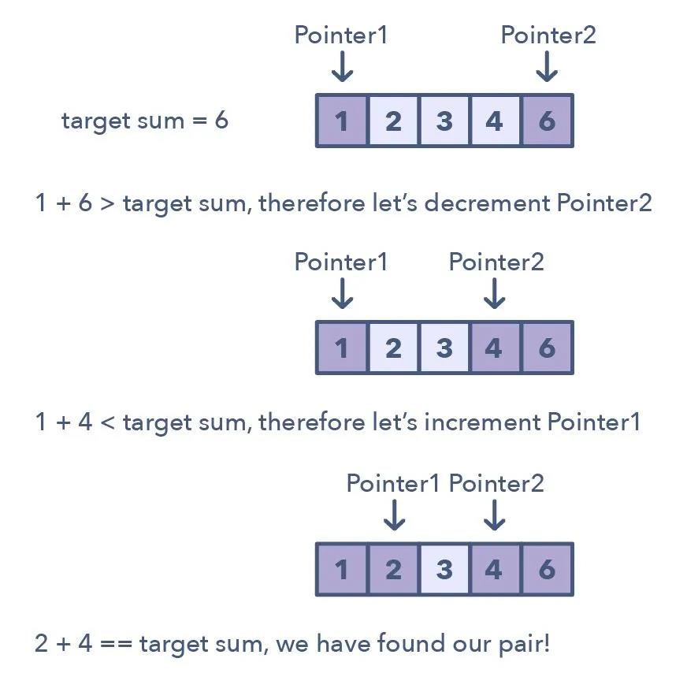
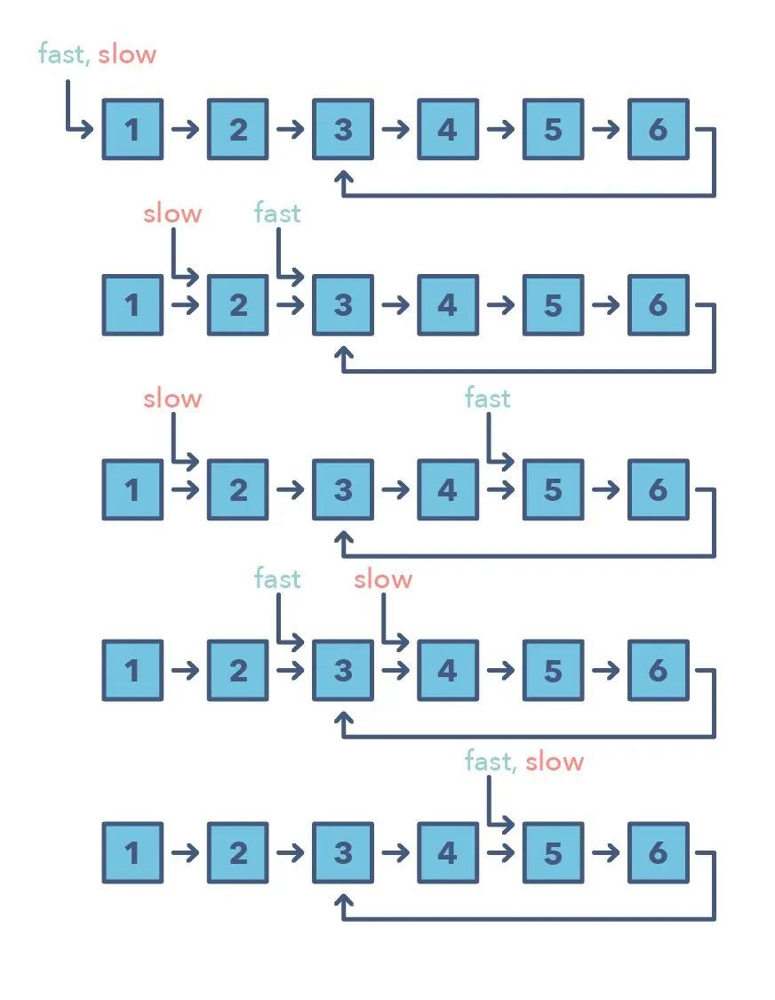
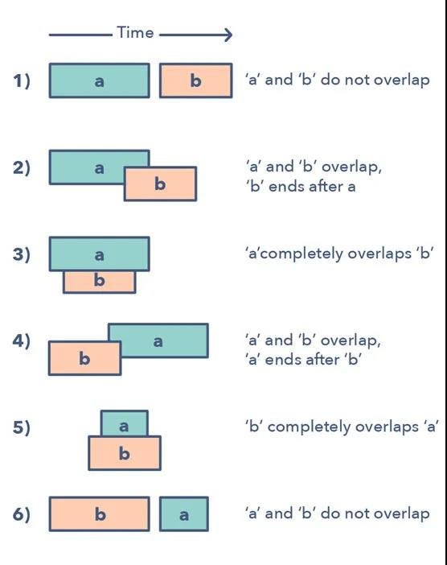
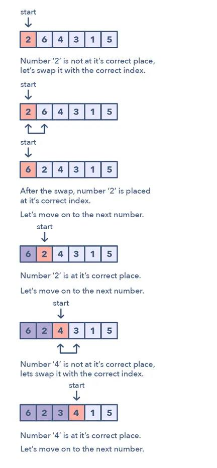
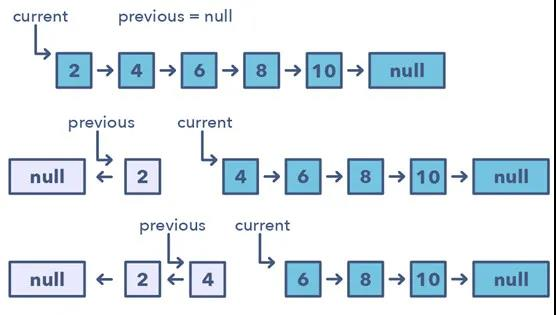
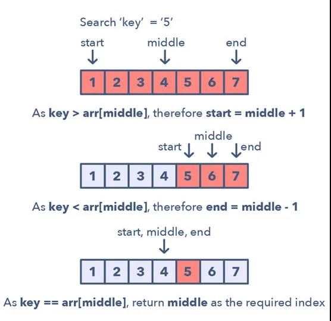

# 建议

1. **打基础的时候，不要太迷恋于库函数。** 
2. 在分析问题的时候，应该首先建立相应的逻辑结构，再选择合适的数据的结构，再用物理结构实现。
3. 如果题目关键的部分用库函数可以直接解决，建议不要用库函数，
4. 如果库函数只是解体过程中的一小部分，并且你已经很清楚这个库函数的内部实现原理，可以考虑使用库函数。
5. 巧妙的**建立哨兵（哨兵有很多种实现方式）**，可以简化代码，统一理解。
6. 所有的大问题都是由数个小问题组成的，学会**分解问题**，一步一步去解决，当你解决所有的小问题时，大问题也就解决了。
7. 仔细考虑题目所给的条件，不要漏写重写，
8. 将实际问题抽象化，从中提取出数据结构的模型，并采用适当的算法，即可写出一个较好的程序。
9. 对数组或者vector使用下标索引访问时，要**检查索引的有效性**。
10. 对指针或者迭代器解引用时，要**检测指针是否为空**，二者均存在**超尾**的概念。
11. 运算中有加法和乘法都要考虑到溢出的问题。
12. 在解决问题之前，一定要明确题目要求，如：**求任意一个**还是**求所有**，要求是**空间换时间**，还是**时间换空间**。
13. 所有的 

# 数据结构

## 1. 数组

1. 对数组做原地删除操作时，可以使用一个循环，两个下标。直接在原数组中进行修改。双指针在数组中的应用就是双下标。

2. 数组在使用之前，一定要检测是否为空，如果是数组名作为函数形参，则会退化为指针，要检查指针是否为空，并且检验所给长度是否小于0；

3. 因为数组中的元素在内存地址上是连续的，因此不能单独删除某个元素，只能**覆盖**。如果释放必须释放所有空间（比如程序结束，回首栈空间）。

4. 一维数组在内存中占据连续的空间，我们可以根据下标定位对应的元素，支持随机访问。

5. 区分数组的容量和大小，容量时编译时决定，大小时运行时决定。

6. > If you need to add or delete a node frequently, a linked list could be a good choice.

   > If you need to access an element by index often, an array might be a better choice than a linked list.

  9. **对原数组变动之后可能会影响之后对数组的操作的情况，可以尝试创建一个临时数组。(难点)**

  10. 对数组的插入可以先创建一个新数组，然后用循环改变原数组的值,  数组的插入必须注意位置，主要分为在**所有元素之前**，在**部分元素之间**，在**所有元素之后**。

  11. 数组一定要注意**边界问题**，尤其时对数组进行添加和删除的时候，一定要先考虑所给**下标是否越界**。

  12. **C++**中vector和string优先于动态分配的数组。

  13. 数组的**添加**，从最后一个元素开始向前，依次将其向后一个单元复制，直到指定下标。

  14. 数组的**删除**，从所给下标之后的第一个元素开始向后，依次将其向前一个位置复制，直到最后一个元素.

  15. 对数组进行操作时，数组**是否已经经过排序**十分重要，将直接影响到执行的操作。

  14. 同时数组中的元素是否**互异**也会对解题造成很大的影响。

  15. 对数组使用**二分法**数组必须时经过**排序**的,在使用二分法时一定要注意：

> 1. 二分查找必须对有序的数据结构
>
> 2. 二分查找的循环中，坚持循环不变量的原则。二分查找可以有改进的版本
>
> 2. 对于局部有序的数组，可以对局部进行二分查找，对于局部有序的数组，必须确定一个有序的局部，在这个局部中，才可以再次使用二分查找，比如：旋转数组，当调整范围时，现确定中间值位于那个局部有序的区间。
>
> 3. 当题目涉及到的有序的时候，可以多想一想二分查找，当题目涉及到需要选中多项时，可以考虑双指针，甚至多指针，
>
> 4. 当题目设计到两个索引双重循环的时候，可以考虑滑动窗口，可以减少一层循环

11. 注意对特殊情况的**合理处理**；
12. 如果对题目没有思路，可以先进行排序，再观察规律。
16. 与**元素所在位置有关**的题目，注意是否可以进行排序，大部分均不可。
17. 计算字数列的长度，可以用**计数器，也可以用下标的差值**。
18. 数组存在**超尾**的特征，因此在向数组中进行**插入操作**时，下标可以等于数组长度，不视为越界。而链表却也相同。
19. 对于数组：无序无序向量只能通过判定即 “ ==” 和 “!=”; 对于有序向量则是比较，即通过 “>” 和 “ <”; 即无序向量只能“比对”，有序向量才可以称为“比较”。
20. 对于数组与链表的删除操作来说，则不存在超尾的概念，注意下标索引的检测。
21. 对于数组去重问题，可以先排序，再去重，可以使用双指针，或者滑动窗口。数组**去重问题**，如果是已经排序的数组，可以用**一个变量**来记录元素出现的次数，如果是没有排序的数组，则需要引入一个**hashmap**来记录元素出现的次数。
22. 对于数组的插入，多使用“<” 号可以表示位置关系（即：左还是右）
23. 对于全局对称类问题，一般都是算一半，另一半用做差得出。
21. 数组（向量）更适合使用冒泡排序，选择排序，或者归并排序。
22. 对于数组中元素的值和数组的下标有关的问题，经常需要在遍历数组时将数组元素的值与其下标作比较来运算。
23. 数组还有一个比较重要的问题，就是**二维数组的模拟**问题，这种问题往往要分好段，类似于二分查找确定循环不变量，防止在循环中发生错误，可以在下面多模拟模拟。

## 2. 链表

1. 对于链表来说，优势在于添加与删除较为方便，但是不能做到随机访问。应根据数据的特点，选择合适的数据类型。
2. **链表的和树**的许多操作需要**大量的指针**，在解决相关问题时一定要留意代码的鲁棒性，否则容易出现程序崩溃的问题
3. 循环链表问题可以考虑用快慢指针进行解决，快慢指针迭代的速度不相同。
5. 对于链表，**双指针（快慢指针）**是十分有用的处理办法。可用于判断**循环链表**。
6. 对于单链表而言，对当前链表元素的操作，经常需要涉及到**当前元素的前一个元素**，即建议，尽量对当前元素的下一个元素进行处理，而非处理当前元素。
7. 对于链表的操作，尤其需要注意对**头结点**和**尾节点**的特殊操作。
9. 对于链表与数组，求**两数和**的问题，要时刻注意**进位**带来的变化，如有进位要再次添加项。
10. 对于链表中的节点，在使用之前（包括两种解引用），都需要**检验指针是否为空**。防止程序崩溃。
11. 因为指针，链表变得更加多变，链表的相关位置信息就在于指针，可以说**考察链表**就是**考察指针**。一般而言，翻转链表的话，如果给定的是一个范围，则一定要判断这个范围是否合法，以及这个是否涉及到要改变头指针。
12. 一般情况下，头指针可以代替链表，在对链表操作时，除非必要不要改变头指针的值。
13. 对单链表的操作，经常需要当前节点的前一个节点，因此**双指针法**，对单链表来说很重要。特别是对于环形链表来说。
12. 对于环形链表，可以用快慢指针确定一个链表是否环，也可以确定环的入口（可以通过数学计算算出公式，不然就背结论），当快指针和慢指针相遇时，将快指针改为每次移动一步，慢指针不变，接下来二者一起移动，最终二者一定会相遇，而且相遇的节点就是环形链表的入口；
13. 当认为双指针可以解决问题，但最终却没能解决的时候，可以考虑创建一个新的链表。
14. 创建一个链表，先创建一个新的节点，在创建一个新的指针指向这个节点，
15. C++ 中定义链表节点时，最好给**定义一个构造函数**，如果没有提供，编译器会提供一个**默认构造函数**，这个默认构造函数，**不能提供参数**，对新节点进行初始化。
16. 常见的链表的操作方式：

    1. 直接使用原来的链表进行操作。
    2. 设置一个虚拟头节点再进行操作。
    3. 设置一个**虚拟头结点**，可以避免对头节点的特殊操作（最常见的是需要删除头结点的情况），达到对链表中所有节点操作统一的目的。
17. 对于单向链表的大部分操作，都需要保留指向**当前节点的前一个节点**。
18. 当需要**改变链表中节点**的位置时，把链表中的每个节点作为一个独立的点看待，你可以挨个连线。
19. 当需要**删除头结点**时，可以考虑设置一个**虚拟头结点**，此时可以将原头结点作为一般节点使用：
    1. 直接使用原来的链表进行操作。
    2. 设置一个虚拟头节点再进行操作。
20. 删除链表中的重复元素，注意删除的是当前节点之后的节点，此时需要注意迭代的指针，删除后面的元素，当前节点不用迭代。链表类型的问题，需要考虑是否对头结点或者尾节点进行特殊操作，对于操作涉及头结点，可以创建一个虚拟的头结点，对于操作涉及尾节点，注意迭代时的范围。
21. 对于数组来说，删除一个元素的实质是覆盖重写，而对于链表来说，删除既可以是将该节点从链表中删除，也可以是对链表进行**重写**。
22. 当delete一个节点之后，需要把指向节点的指针重新指向为空，防止**悬垂指针**。（虽然leetcode中不要求释放动态管理的内存，但最好手动释放资源后将，原来的指针置为空）。delete之前，检查指针是否为空，不能释放空指针指向的资源，delete之后，将节点置为空，防止悬垂指针。
23. 遍历时，根据是否需要对尾节点进行操作，循环的条件不同，如果不对尾节点进行操作，则判断条件为**当前节点的next节点不为空**，如果需要对包括尾节点在内的所有节点进行操作，则判断条件为**当前节点不为空**。
24. 当需要**复制链表**时，可以在原节点的下一个位置进行复制，最后再进行拆分（类似于奇偶子链）。
25. 一定要区分指向链表节点的指针和节点本身的地址，而这不一样，指针可以改变指向的地方，但是节点的地址是固定的。
26. 链表的灵魂就是指针，链表的难点也是指针。
27. 当用一个指针遍历不能解决问题的时候可以考虑**两个指针遍历**，可以让其中一个速度快一些，或者让其在链表上先行若干步。需要查找链表中指定位置的节点，也可以用双指针法。
28. 插入排序更适合链表，移动元素的成本呢较低。

## 3. 队列

1. 队列先进先出的数据结构，**不支持随机访问**，**不允许遍历**，**不提供迭代器 **。
2. SGI STL 中队列以dequeue为缺省的底部结构。
3. STL中队列不被归为容器，而被归类为容器适配器。 
4. 队列与**广度优先算法**紧密相关，
5. 窗口问题对应的数据结构就是**双端队列**。
6. 队列：从队列中出队时必须要检查，队列是否为空，若为空，则不能执行删除操作，否则程序崩溃。

## 4. 栈

1. 栈中所有元素必须符合**先进后出**的规则，所以栈**不提供随机访问功能**，也**不提供迭代器**， **不允许遍历**。 
2. 栈是一种与**递归**紧密相关的数据结构。
3. 栈是以底层容器完成其所有工作，对外提供统一的接口，底层容器时可插拔的（也就是说我们可以控制使用容器来实现栈的功能）。
4. STL中stack不被归为类容器，而被归类尾container adapter(容器适配器)。
5. SGI STL以**dequeue**为缺省情况下的底部结构，链表也可一作为底层的一种实现。
6. 从栈中弹出元素之前，必须要**检查栈是否为空**，否则程序会崩溃。
7. 栈的一种压入序列可能对应多种弹出序列，判断一种弹出序列能不能对应该种压入序列，需要一个辅助栈。
8. 利用栈先进后出的特性，栈经常用于解决**匹配**问题。
9. 涉及到逆序的问题，都可以考虑使用栈的后入先出的特点来思考。
10. 字符串去重问题 
11. 逆波兰表达式问题 
12. 单调栈的应用， 
13. 栈的应用：
14. 逆序输出：输出次序与处理输入**颠倒**；递归深度和输出长度不易预知，如： 进制转换
15. 递归嵌套：具有**自相似性**的问题可以递归解决，但分支位置和嵌套深度不确定。如：括号匹配
16. 延迟缓冲：线性扫描模式算法中，在预读足够长的长度后，方可确定处理的前缀，如：
17. 栈式计算：基于栈的特定计算式 
18. 栈混洗：按照某种规则对栈内元素进行排列
19. **单调栈**：单调栈通过维持栈内值的单调递增（递减性），在**整体O(n)的时间**内处理**需要大小比较**的问题，可以省去一层循环。
20. 单调栈：
    1. 如果找到每一个i位置左边和右边里i位置最近且值比arr[i]小的位置，那么需要让stack从栈顶到栈底是单调递减的。
    2. 如果找到每一个i位置左边和右边离i位置最近且值比arr[i]大的位置，那么需要让stack从栈顶到栈底是单调递增的。
    3. 通常情况下，单调栈中保存的是数组下表，而非数组中的值。
21. 还有好多没学，以后再补充

## 5. 哈希表

1. 哈希表：一般用来**快速判断一个元素是否出现在集合中**，哈希表实质就是**牺牲空间换时间**。

2. 哈希的另一个特点是可以**自动去重**，对结果进行处理。

3. 当使用set（集合）来解决问题时，优先使用unordered_set查询和**增删改查**的效率是最优的，如果set是有序的，就用set，如果要求不仅有序，还要有重复数据的，用multiset。

4. 数组其实就是一个简单的哈希表，但使数组的大小是受限制的，很多时候，在**问题规模较小**，且**不需要设置复杂hash函数**的时候，可以考虑**使用数组来代替map或者set来节约空间**。

5. 使用数据做哈希的题目，都限制了数据的大小，可以拿**数组当哈希表来用**，但**哈希直不能太大**。如果哈希值比较少，特别分散，跨度非常大，使用数组就造成空间的浪费。

6. | 集合               | 底层实现 | 是否有序 | 数值是否可以重复 | 能否更改数值 | 查询效率 | 增删效率 |
   | ------------------ | -------- | -------- | ---------------- | ------------ | -------- | -------- |
   | std::set           | 红黑树   | 有序     | 否               | 否           | O(logn)  | O(logn)  |
   | std::multiset      | 红黑树   | 有序     | 是               | 否           | O(logn)  | O(logn)  |
   | std::unordered_set | 哈希表   | 有序     | 否               | 否           | O(logn)  | O(logn)  |
   | std::map           | 红黑树   | key有序  | key不可重复      | key不可修改  | O(logn)  | O(logn)  |
   | std::mulitmap      | 红黑树   | key有序  | key可重复        | key不可修改  | O(logn)  | O(logn)  |
   | std::unordered_map | 哈希表   | key无序  | key不可重复      | key不可修改  | O(logn)  | O(logn)  |

7. 查找有固定规律的集合，可以考虑使用哈希表。

8. 使用数组和set来做哈希法的局限：

   1. 数组的大小是受限制的，而且如果元素很少，而哈希值太大会造成内存空间的浪费。
   2. set是一个集合，里面方的元素只能是一个key（对于set，值就是键（即key就是value））.
   3. map存储的是键值对（即key对应value）, 

9. 散列表的解题关键在于**确定key和value**,并判断是**key和value是否是同一类型**，进而确定**选择set还是map**，接着继续判断，根据要求，判断**是否有序**，元素**是否可以重复**，如果没有额外的要求，**首先选择无序且没有重复的版本**，其查询和增删的效率是最高的。

10. 散列函数数越是随机，越是分散，越没有规律，越值得选择。

11. 散列函数的几个特点：计算简单、散列地址分布均匀，计算散列地址所需的时间，关键字的长度，散列表的大小，关键字的分布情况，记录查找的效率。

12. 我（伪）随机数发生器的实现，因具体平台，不同历史版本而异，创建的散列表可移植性差，谨慎使用。

13. 多槽位法：预留过多，空间浪费，无论预留多少，极端情况下仍有可能不够。

14. 独立链： 每个桶存放一个链表的头指针，无需伪每个桶预留多个槽位，任意多次的冲突都可以解决，删除操作实现简单、统一，指针需要额外空间，节点需要动态申请。

15. 开放定址 

16. 线性试探法(Linear probing)：一旦冲突，查找紧邻的下一个桶，为了避免当前的冲突可能产生更多的冲突。

17. 平方试探：查找链上各桶的间距增加，可一定程度避免冲突，可能会降低查找效率，增加空桶的数量，并且无法找到重复利用。

18. 懒惰删除：仅作删除标记，查找链不必续接，直接删除可以会使查找链中断。

## 6. 字符串

1. 字符相等的概念：长度相等，且对应的字符均相等
2. 字符的术语: 字串（是母串的子集）、前缀，后缀、空串。（空串不等于空格串，只是其长度为0）
3. 字符：不同于线性表（更关注单个元素的操作），串更多的是查找字串位置、得到指定位置的字串，替换字串的操作。
4. 串的链式存储结构除了链接串与串操作时有一定方便之外，总的老说不如顺序存储灵活，性能也不如顺序存储结构好。
5. 当需要固定规律一段一段去处理字符串的时候，可以考虑改变for循环的表达式来解决问题。字符串中的替换问题，如果字符串本身是不可变的，则需要重新创建新的字符串，进行操作。
6. 如果对原字符串，在原位置上不容易修改，可以重新创建一个字符串，进行对应的操作。
7. 反转字符串，
8. 在C++中，因为通常用类string来表示字符串，不同于C风格字符串，string提供了size接口，因此不需要````'\0'````结尾， 而vector<char>和string较为接近，但string类提供类更国对字符串操作的接口。
9. 在分析字符串相关问题的时间复杂度时，也要同时分析相关库函数的时间复杂度。
10. 数组填充类问题： 很多数组填充类问题，都可以预先给数组扩容到填充后的大小，然后**从后向前**进行操作。这样做有两个好处：
    1. 不用申请新的数组。
    2. 从后向前填充数组元素，避免类从前向后填充元素带来的每次填充元素都要添加元素之后的所有元素向后移动。
11. KMP:事先构造一种查询表，借助模式串自身的一种匹配性。其**主要思想**是：当出现字符串不匹配时，可以知道一部分之前已经匹配的文本内容，可以利用这些信息**避免从头再去做匹配 **。
12. 前缀表：下标i之前（包括i）的字符串中，有多大长度的相同前缀后缀，前缀表具有告诉我们当前位置匹配失败，跳到之前已经匹配过的地方的能力。
13. next数组就是一个前缀表，前缀表是用来**回溯**的，它记录模式串和主串（文本串）不匹配的时候，模式串应该从那里开始重新匹配。
14. next 数组的构造过程与kmp的主要过程在本质上是一致的。模式串next表的构造过程就是模式串自身匹配的一个过程。
15. kmp的可用判断一个串中是否出现过另一个串，主要应用于字符串匹配问题中。
16. zifuzhuan

## 7. 双指针法：

1. 双指针：当用于求子数列时，很有用，对于循环表很有用， 
2. 对于数组的**原地操作**可以减少一层循环。
3. 对于在一个数组或者链表中求得一个以上的元素可以减少一层循环。
4. 双指针法：可以用来从两端同时遍历数组，从而将O(N2)降为O(n)；双指针法可以也仅能减少一层循环。
5. 快慢指针：双指针法基本主要应用在数组，字符串和链表中。
6. 滑动窗口：

## 8. 二叉树

2. 书写递归的三要素：

> 1. 确定递归函数的参数和返回值。
> 2. 确定递归的终止条件（和循环一样）
> 3. 确定单层递归的逻辑（设计单层递归有点类似循环）

1. 递归算法的关键就是**明确函数的定义**，**相信这个定义**，而不要跳进递归细节。
2. 树是一种无环联通图，极小联通图，极大无环图。
3. 二叉树的**层序遍历**就是图论的广度优先搜索（**BFS**）的应用，需要借助**队列**来实现。
4. 二叉树：对于前序遍历和后序遍历比较像（可以判断根节点），只知道前序遍历和后序遍历的结果是无法推断出二叉树的，而知道中序加上前序或后序就可以知道二叉树
5. 二叉数的迭代法： 前序遍历和中序遍历不同， 前序遍历中访问节点（遍历节点）和处理节点（将元素放入数组着中）可以同步处理，但中序遍历无法做到同步。 
6. 二叉树的迭代遍历方法，就是模拟图论的深度优先搜索（**DFS**），使用栈来实现。
7. 使用迭代法写中序遍历，需要借用指针的遍历来帮助访问节点，栈则用来处理节点上的元素。 
8. 二叉树的问题，解题之前一定要知道想清楚用哪种**遍历方式**，前序，中序，后序还是层序遍历，
9. 二叉树的处理，有不同的遍历方式，因此有不同的顺序，另外加上不同的实现(如： 栈的LIFO， 队列的FIFO)。
10. 从时间复杂度上来说**迭代法**和**递归法**差不多（在不考虑函数调用开销和函数调用产生的堆栈开销），递归的**开销会大一些**，因为因为递归的需要系统堆栈存参数返回值等。
11. 递归更容易让人理解，但对机器不友好，实际工作开发中，应尽量避免使用递归（实际项目代码参数，调用关系都比较复杂，不容易控制递归深度，甚至会栈溢出）。
12. 层次遍历相对容易一些，只要掌握基本写法（即框架模板），剩下只需进行逻辑上的修改。
13. 二叉树的高度增长是对数级，宽度增长是指数级。
14. 二叉树求**节点数量**和**深度**问题：采用**前序遍历、或者后序遍历**的递归方法，或者**层序遍历**的方法,但是求某一节点的**高度**问题，只能通过**后序遍历**的方法。根节点的高度就是全树的深度。
15. 注意二叉树中节点的**深度**与**高度**不同： 深度从根节点到该节点最长简单路径边的条数，高度从该节点到叶子节点最长简单路径边的条数。
16. 求深度：可以**从上到下**去查，所以需要前序遍历（中左右），
17. 求高度： 只能**从下到上**去查，只能用后序遍历（左右中）；
18. 二叉树问题很多涉及递归，而**递归和回溯是一一对应**的，有一个递归，就要有一个回溯，后序遍历往往对应回溯，路径问题常常涉及到回溯，需要特别注意
19. 到达**叶子节点**的判断依据是该节点的**左右子树均为空**。二叉树问题一定要考虑清除所给二叉树的各种可能的形态（如：只有左子树，或者只有右子树）。
20. 需要计算叶子**节点的个数**时通常采用**后序遍历**，原因是要通过递归函数的返回直来累加求取需要的值。
21. 递归函数需不需要**返回值**：如果需要**遍历整棵树**，递归函数就不能有返回值，如果需要遍历**某一条固定路线**，递归函数就一定要有返回值。
22. 在**递归函数有返回值**的情况下，如果要**搜索一条边**，递归函数返回值不为空的时候，立刻返回，如果**搜索整棵树**，直接用一个变量left、right接住返回值，这个left、right后续还有逻辑处理的需要，也就是后序遍历中处理中间节点的逻辑。
23. 递归是一种自上而下的思考方式，迭代是一种自下而上的思考方式，
24. 写树的相关问题，先搞清楚当前root节点该做什么，然后根据函数定义，递归调用子节点。
25. 递归和循环相同，也要掌握不变量。
26. 构造树一般采用前序遍历，先构造根节点，再构造左子树，再构造右子树，对于需要递归的题目，可以用哈希表存储遍历结果，可以降低时间复杂度，减少不必要的开销，本质上是一种空间换时间的策略。
27. 用数组构造二叉树的题目，每次分隔尽量不要定义新的数组，而是通过下表索引直接在原数组上进行操作，可以减少时间和空间的开销。
29. 镜像二叉树：
    1. 二叉树的镜像：可以采用前序或者后序的方式。
    2. 对称二叉树，可以把二叉树的左右子树（前提是存在）作为两颗数，采用不同的遍历方式组合遍历，也可以同时比较两颗二叉树，采用不同的遍历方式，
30. 构造二叉树
    * 分割时候，坚持区间不变量原则，左闭右开，或者左闭右闭。
    * 在测试用例中，除了要考虑不合法的输入，还有考虑到输入的前序遍历序列和中序遍历序列不匹配的情况。
    * 分割的时候，注意后序或者前序已经有一个节点作为中间节点，不能再继续使用了。
    * 如何使用切割后的后序数组老切割中序数组？利用中序数组大小一定是和后序数组大小相同这一特点进行切割。
    * 构造二叉树，可以采用中序遍历加上后序或者前序遍历，由后序或者前序遍历来判断根节点，切割中序遍历，形成左右子树，然后递归切割，特别的如果已知原树是一棵二叉搜索树，则只需要其前序遍历或者后序遍历，用前序遍历或后序遍历得到的根节点来切割前序遍历活后序遍历的数组，
    * 涉及到二叉树的构造，无论是普通二叉树还是二叉搜索树，一定是前序遍历，都是采用前序遍历构造先中间节点。
    * 用数组构造二叉树的题目难点在于对数组的合理切分，注意此处依旧要坚持“**循环不变量原则**”。注意分割区间的统一性。
    * 每次分隔尽量不要定义新的数组，而是通过下表索引直接在原书组中操作，这样可以节约时间和空间的开销（可能需要更改递归的终止条件）。
31. 二叉搜索（排序）树：
    1. 对于二叉搜索树，因为节点的有序性，不用辅助栈或者队列也可以写出迭代法。二叉搜索树结合了，**有序向量**和**链表**的特点。
    2. 二叉搜索树的**中序遍历查**找类似于有序向量的**二分查找**。
    3. 对于二叉搜索树，不需要回溯的过程，因为节点的有序性已经帮我们确定了搜索的方向。
    4. 二叉搜索树中不能右重复元素。
    5. 验证二叉搜索树，相当于判断一个序列是不是递增的；**不能单纯的比较左节点小于中间节点，右节点大于中间节点**，应该比较的是：**左子树的所有节点小于中间节点，右子树的所有节点大于中间节点**。
    6. 二叉搜索树因为其性质的特殊性，一般情况下使用**中序遍历**最合适。二叉树的迭代法往往会有非常精妙的作用。
    7. 在二叉树中通过**前后两个指针**做比较会经常用到。即保留前一个节点的值，或者保留指向前一个节点的指针。
32. 二叉搜索树删除节点问题：
    1. 没找到要删除的节点，遍历到空节点直接返回 
    2. 找到删除删除的节点 : 
       1. 左右孩子都为空（叶子节点）直接删除节点，返回nullptr为根节点
       2. 删除节点的左孩子为空，右孩子不为空： 删除节点，右孩子补位，返回右孩子为根节点 
       3. 删除节点的右孩子为空，左孩子不为空： 删除节点，左孩子补位，返回左孩子为根节点。 
       4. 删除节点的左、右孩子均不为空： 择吉那个删除节点的左子树头结点（左孩子）放到删除节点的右字数的最左面节点的左孩子上，返回删除的节点的右孩子为新的根节点。
       5. 总结：二叉搜索树的排序问题就是在找删除节点的前驱或者后继节点替换，二者方法上是差不多的。
33. 二叉树公共祖先问题：
    1. 需要从底向上遍历，二叉树只能通过后序遍历（即：回溯）实现。
    2. 在回溯的过程中，必然要遍历整颗二叉树，即使已经找到结果，也依旧要把其他节点遍历完，因为要使用递归函数的返回值来进行逻辑判断。
    3. 对于二叉搜索树而言，没有必要通过后序遍历整个二叉树，这样可以提高效率，
34. 递归函数有返回值
    1. 搜索一条边: ````if (递归函数(root->left) return; if(递归函数(root->right)) return;````
    2. ````left  = 递归函数(root->left); right = 递归函数(root->right);left 和right的逻辑处理 ````
34. 涉及到循环和递归的时候一定要注意**不变量**。
35. 涉及到二叉树的构造，无论是普通二叉树还是二叉搜索树，一定是前序遍历，都是采用谦虚遍历构造先中间节点。用数组构造二叉树的题目难点在于对数组的合理切分，注意此处依旧要坚持“循环不变量原则”，每次分隔尽量不要定义新的数组，而是通过下表索引直接在原书组中操作，这样可以节约时间和空间的开销（可能需要更改递归的终止条件）。
36. 求普通二叉树的属性，若要通过返回值做一定量的计算，一般是后序（求深度也可用前序），
37. 树形dp的一般套路：
    1. 以某个节点为x为头节点的子树中，分析答案可能来自哪些可能性。
    2. 根据第一步的可能性分析，列出所有需要的信息。
    3. 根据第二步的信息汇总，定义````ReturnType````类型。
    4. 设计递归函数，递归函数是处理以x为头节点的情况下的答案，包括设计递归的base case，默认直接得到左树和右树的所有信息，以及把可能性做整合，并且也要返回第三步的信息结构
38. 求二叉搜索树的树形，一定是中序。
39. 二叉树中加入节点：
    1. 通过下一层将节点返回，本层用root-left或root->right接住，来完成父子关系的赋值操作。
40. 二叉树和递归是紧密结合的。
41. 对二叉树的采用何种遍历方式，需要根据题意慎重选择。
42. 尾递归：递归语句位于函数的尾部，较为荣膺从递归形式改为迭代形式，来提高效率。
43. 二叉树的序列化是指通过某种遍历方式将二叉树以某种格式保存为字符串或者是数组，从而使得内存中建立起来的二叉树可以永久保存，
44. 二叉树的反序列化：是指将从字符串、文件或者数组中，重构二叉树。

## 9.回溯

1. 简介：回溯法也可叫做回溯搜索法，是一种搜索的方式。回溯是递归的副产品，只要有递归就会有回溯，所以回溯函数，也就是递归函数，

2. 回溯比较难以理解，但是回溯法也并不高效，因为回溯的本质是穷举，穷举所有可能，然后选出我们想要的答案。一般只有暴力枚举才能得到结果时，我们才会选择回溯，这种递归解法，否则，其他题目使用是可能会导致栈溢出。

3. 处理与回溯是相反的，处理要加，回溯就要减。

4. 回溯法一般可以解决以下几类问题：

   1. **组合**（不强调元素顺序）问题：N个数里面按照一定规则找出k个数的集合，有同一集合中做组合，也有不同集合中做组合。如果是一个集合求组合的话，就需要start_index，来控制for循环的起始位置，如果是多个之间不互相影响的集合，就不用。一般情况下，<u>**去重**需要先对集合元素进行**排序（去重是在同意父节点下的同一层）**</u>。
   2. **排列**（排列是强调**元素顺序**）问题：N个数按照一定规则全排列，有几种排列方式，排列每次的宽度都是从0开始，排列中每个元素只能使用一次，所以要**标记每个元素是否已经被使用过**。排列的话，每层都是从0开始搜索，需要标记每个元素是否已经使用过了。
   3. **切割**问题（**类似组合**问题）：一个字符串按照一定规则有几种切割方式，可以使用回溯搜索法列出所有可能的结果，也可以抽象为树型问题。切割问题可以理解为**切割点的组合**问题。
   4. **子集**问题，一个N个数的集合里面有多少符合条件的子集，求**组合问题**和**分割问题**就是收集树的**叶子节点**，而子集问题是找**树的所有节点**。求子集问题不需要剪枝，因为求子集是求所有的节点的集合。**注意**：子集问题于子序列问题不同，子集问题一定要排序。
   5. **棋盘**问题：N皇后，解数独等

5. 理解回溯算法：回溯法解决的问题（其实也包括递归问题）都可以抽象为树形结构（N叉树），回溯发解决的都是在地喝中递归查找子集，集合的大小就构成来树的宽度，递归的深度，都构成了树的深度。

6. 回溯算法模板：

   1. 回溯函数模板及返回值参数：````void backtracking(parameters)````
      1. 函数明一般backtracking
      2. 返回值一般为void
      3. 参数以内不容易确定，一般都是先写逻辑，然后需要什么参数，再进行填写。
   2. 回溯函数终止条件：既然可以理解为树的问题，那么终止条件就也就是树的终止条件。
   3. 回溯搜索的遍历过程：for循环可以理解是横向遍历，backstracking（递归）就是纵向遍历。

   ````c++
   void backtracking(parameter) {
   	if (end-condition) {
   		存放结果；
   		return；
   	}
   	for(选择：本层集合中元素（树中节点孩子的数量就是集合的大小）) {
   		处理节点;
   		backtracking(路径，选择列表)；
   		回溯，撤销处理结果
   	}
   }
   ````

7. 组合问题：每次从集合中选取元素，可选择的范围随着选择的进行而收缩，调整可选择的范围。**剪枝的精髓**就是：for循环在寻找起点的三时候要有一饿范围，如果这个起点到集合终止之间的元素已经不够题目要求的k个元素，就没有必要搜索了，

8. 回溯法抽象为树形结构后，其遍历过程就是：for循环横向遍历，递归纵向遍历，回溯不断调整结果集

9. 组合问题既然涉及到循环和递归，那么在设计时，也要注意其循环不变量的设置。始终坚持循环不变量。

10. 对于**二维数组上的查找与匹配**问题，也可以用回溯法来解决。

11. 回溯和深搜有极大的相似之处。

12. 对于递归产生的对一个变量的多次求值问题可以使用

    1. 记忆的办法：将已经计算过实例的结果制表备查（空间换时间）。
    2. 动态规划：颠倒计算方向：由自顶向下递归，为自底向上迭代。  

13. 找出对应的**深度（同一树枝）和宽度（同一树层）**。确定循环逻辑，回溯法中回溯函数的参数很难一次性确定下来，所以往往需要修改几次，直到符合条件为止。

## 10.贪心

1. 贪心的**本质**是**选择每一阶段的最优从而达到全局最优**。贪心没有套路，说白了就是简单的常识性推导加上举反例
2. 做贪心问题的步骤：
   1. 把全局问题分解为几个子问题。
   2. 找出合适的贪心策略。
   3. 求解每一个子问题的最优解。
   4. 将局部最优解堆成全局最优解。
3. 贪心算法经常需要先排序，再进行其他的操作。
4. 贪心和动态规划都是求最优解问题比较好的思路，一般该问题都可以分解成为多个自问题，子问题之间还有重叠的更小的子问题。但贪心对比动态规划的特点在于，每一步都可以做出一个最优的选择，基于这个选择，可以得到全局的最优选择。
5. for循环适合**从头到尾的遍历，而while循环适合环形遍历。**
6. 当贪心有**多维的条件**需要满足时，通常考虑首先使其中一个得到满足，再尽力满足另一个。
7. 区间问题无论时删除还是合并，都必须注意操作完成后，左右范围必须要做出适当的调整。排序 + 遍历 + 左右范围的调整。
8. 贪心类问题的简单问题，有时简单的让人无法意识到使用类贪心，而贪心困难的问题想法却往往出人意料

## 12.图论

1. 图的相关术语比较多
2. 图的不同实现方式有不同的特征，
3. 广度优先搜索（BFS）：可用来求解单点最短路径的问题，
4. 深度优先搜索（DFS）：可用来求解从一点到另一点是否存在路径的问题。可联系回溯进行思考。
5. 图的BFS广度优先遍历，可以参考树的层次遍历，后者可以认为是前者的一个特例

## 11. 动态规划

1. 如果一个问题有很多重复的部分，使用动态规划是最有效的，
2. 动态规划着那个的每一个状态都是由上一个状态推导出来的，这点与贪心不同，贪心直接是局部找最优。
3. 动态规划做题步骤：
   1. 确定dp数组（dp table）以及下标的含义，对于dp数组的含义一定要清晰
   2. 确定**递推公式**（即状态转移方程），确定递推公式的时候，是自上而下的思考，而求解时，是采用自下而上，建立一个数组，避免不必要的计算。可以说动态规划就是递归的优化版，自顶向下思考，自底向上求解，避免来重复的计算，所以很多动态规划的问题，也可以回溯法来解决。
   3. dp数组如何初始化
   4. 确定遍历顺序
   5. 举例推导dp数组
4. 背包问题：关键在于01背包和完全背包，关于背包问题的最好的参考资料是背包九讲，一般面试，掌握01背包和完全背包就可以了，最多再加上完全背包。背包问题需要特别重视**初始化**和**遍历问题**。
5. 动态规划问题的几个**特点**： 
   1. 如果面试题是求一个问题的最优解（通常是求最大值或者是最小值），而且该问题可以分解为若干个子问题，并且子问题之间还有重叠的更小的子问题。
   2. 使用动态规划之前，首先要分析，能否把大问题分解成小问题，分解后的每个小问题也存在最优解，如果把小问题的最优解组合起来能够得到整个问题的最优解，就可以考虑动态规划。
   3. 求一个问题的最优解。
   4. 整体问题的最优解是依赖各个自问题的最优解。
   5. 可以把大问题分解成若干个小问题，这些小问题之间还有相互重叠的更小的子问题。
   6. 从上往下分析问题，从下往上求解问题（由于子问题在分解大问题的过程中重复出现，为了必买那重复求解子问题，我们可以从下往上的顺序，先计算小问题的最优解，并存储下来，再以此为基础求最大问题的最优解）。
   7. 与贪心算法的不同：应用贪心算法时，每一步都可以做出一个贪婪的选择，基于这个选择，我们确定能够得到最优解。
6. 先确定递推公式再进行初始化是因为某些情况下，递推公式决定了初始化的方式。
7. 完全背包问题也是由01背包变化而来，即完全背包的物品数量是无限的。
8. 一个商品可以重复多次放入就是**完全背包**，只能放入一次就是**01背包**，
9. **倒序遍历**是为了保证物体只被**放进背包一次**
10. 背包问题经常可以使用二维数组解决：
11. 滚动数组：将二维dp降为一维dp（即为滚动数组），需要满足的条件是上一层的条件可以重复使用，直接拷贝到当前层。使用动态数组解决动态规划问题，必选外层循环遍历物品，内层循环遍历背包，并且初始化采用倒序遍历。
12. 完全背包：使用滚动数组解决完全背包问题时，外层遍历物品和内层遍历背包的顺序可以颠倒。完全背包中每个物品可以添加多次，所以遍历背包时应该从小到大进行遍历。求**组合数**就是外层循环遍历物品，内层循环遍历背包，求**排列数**就是外层循环遍历背包，内层循环遍历物品。
13. 求填满背包的有多少种方式相关的题目，其递推公式十分相似。
14. 做动态规划最好的办法就是自己去**手动模拟（画图）**一遍，动态规划类问题跟踪调试的最好方法是打印日志，
15. 背包问题：背包问题，一定要注意嵌套循环的顺序，特别是求组合数相关最优解，背包问题一般分两类，一类是求装满背包的最大价值，一类是求满足条件的最大组合数或者排列数，这两种问题的地推公式都是可以记住的。
16. 打家劫舍：简单来说就是数组连续元素二选一，成环之后数组连续元素二选一，二叉树中连续元素二选一。
17. 股票交易问题：需要明确当天个买卖股票时，由多少种不同的状态，对每个状态求最优，然后总体最优，
18. 递增子序列问题：
    1. 不连续递增子序列的状态由前0～i - 1个状态有关，连续递增的子序列只与前一个状态有关。
    2. 子序列问题一般不能排序，
    3. 定义坐标含义为0～i-1相当于链表的虚拟头结点，可以更好的求出第一项的结果。
19. 动态规划：
20. 字符串匹配：与子序列问题有类似的解法与思路。
21. 编辑距离问题，
22. 回文子串：回文子串是连续的，回文子序列不是连续的。
23. 字符串

## 13. 递归

1. 递归总有一个最简单那的情况--方法的第一条语句总是一个包含return的条件语句。
2. 递归调用总是去尝试解决一个规模更小的子问题，这样递归才能收敛到最简单的情况。
3. 递归调用的父问题和尝试解决的子问题之间不应该有交集。

## 编程技巧

1. 在判断两个浮点数是否相等时，不要用````a==b````,应该判断二者之差的绝对值````fabs(a-b)````是否小于某个阈值，例如1e-9.

2. 判断一个整数是否是为奇数，用````x % 2 != 0````,不要用````x % 2 == 1````,因为x可能为负数，

3. 用**char** 的值作为**数组下标**（例如，统计字符串中每个字符出现的次数），要考虑到char可能是负数，即使考虑到并强转为unsigned int再用作下标，仍然不正确，正确办法是先强转为**unsigned char**,再用作下标（涉及C++的整形提升规则）。(`//用 char 的值作为数组下标（例如，统计字符串中每个字符出现的次数），要考虑到
   //char 可能是负数。有的人考虑到了，先强制转型为 unsigned int 再用作下标，这仍然
   //是错的，因为char会先字节扩展变为int，再从int变为unsigned int。
   //正确的做法是，先强制转型为 unsigned char，再用作下标，这时会再隐式转换为int。`)

4. vector和string优先于动态分配的数组，

   1. 首先，在性能上，由于vector能够保证连续内存，因此一旦分配了之后，其性能和原始数组相同。

   2. 如果用new，但是忘记delete，程序会出现崩溃。

   3. 声明多维数组，只能一个一个去new 例如：

      ````C++
      int **ary = new int*[row_num];
      for (int i = 0; i < row_num; ++i) {
          ary[i] = new int[col_num];
      }
      ````

   4. 如果用vector一行搞定

      ````
      vector<vector<int>> ary(row_num, vector<int>(col_num, 0));
      ````

   5. 使用reserve来避免不必要的重新分配。

5. 两个数相乘或者相加时，需要小心其结果溢出。

6. 在写代码的时候一定要注意区分那些变量属于那些集合，不要搞混，不然容易发生数组越界，或者野指针的情况，

7. 避免将非布尔值与布尔值直接进行比较，可以避免比较，使用转换函数，在需要判断的地方自动转化为bool值。

8. 传递指针的时候注意传递指针的目的，如果想修改指针所指的变量的值，则需要向函数传递一个指向这个函数的指针，如果是想改变某个指针的值，则需要吸纳个函数传递一个指向指针的指针，或者一个指针的引用，

9. 如果传递的是指向指针的指针，则在函数中修改指针所指的内容是需要先3解引用，如果传递的指针的引用，则修改指针的内容时，不用解引用。

10. 如果可以的话，最好将编写的函数，写成**泛型**的形式。

11. 一般情况下，如果使用**int**发生溢出的情况，则直接使用**long long**，而不是转而使用**long**。（使用long可能还会出现溢出的情况），

12. 为减少溢出的情况，能用减法就不要用加法，能用除法，就不要用乘法

13. 对于while循环，内层循环中不能越界外层循环，即内层循环必须在外层循环的范围之内改变。for循环不容易出席那这种问题。

14. 对于标准库提供的众多的**泛型算法**，经常接受的是左闭右开区间，平时如果是经常使用左闭右闭区间，在使用泛型算法时，需要做出相应的转换。

15. 有效的利用**预处理**可以降低算法的时间复杂度。 

16. 需要改变指针指向的内容，直接传递指针，需要改变指针本身的内容，传递指针的指针或者指针的引用，特别是在递归中，如果计数器作为终止条件，一定要判断是对**每层**计数还是对**每次递归**计数。

17. 删除一个元素并非真的一定要真的删除（数组的删除只能是覆盖，链表是真的删除），可以做一个删除标记。删除数组中重复的元素，除了可以遍历删除，也可以采用STL 中erase方法（采用双指针的方法，），把所有要删除的元素，交换至末尾，然后resize，或者使用delete指针。

18. 对数据结构中的元素进行操作之前，首先确定，给定的查找索引是否符合规范，元素是否存在，然后才可以考虑进行相应的操作。

## 优先级队列(Pirority Queue)

1. stack、queue都是优先级队列的特例-----优先级完全取决于元素的插入次序。
2. 实现方式上采用，逻辑上，等同于完全二叉树，物理上，直接借助向量实现
3. 优先级队列：可以用来实现堆排序
4. 优先级队列

## 查找

1. 查找最终一定要收敛。
2. 关于查找的更多的东西。

## 高质量的代码

1. 代码的规范性：
   1. 代码的书写清晰。
   2. 代码的布局要清晰。
   3. 代码的命名要合理。
2. 代码的完整性：在写代码之前，尽可能的把可能的输入都想清楚，也就是说在编码之前，要考虑单元测试，通常通过以下几个方面来设计测试用例
   1. 首先考虑的是普通功能测试的用例，首先保证写出的代码能够完成基本的任务。
   2. 尽量突破常规思维的限制，
   3. 考虑各种边界值的测试用例，最常见的地方是迭代和递归的终止处，
   4. 考虑各种可能错误的输入（负面测试）测试用例，

## 排序

1. 常用常考的有十大排序：
2. 选择排序：与输入无关，只与输入规模有关，永远的n平方
3. 冒泡排序：
4. 桶排序：
5. 计数排序：当数列的最大值和最小值差距过大时，不适合使用，当数列元素怒视整数时不适合使用，当数据规模很大时不适合使用，
6. 插入排序：当数据大部分有序，小部分无序是最合适的排序，快排时未排序数据小到一定量，可以退化为插入排序。
7. 希尔排序：不常用，不好理解
8. 归并排序;
9. 快速排序：
10. 堆排序

没有绝对好的排序算法，也没有绝对不好的排序算法，关键要看具体的使用场景。

----------------------


# 算法解体套路（来源：Fahim）

## 1. 滑动窗口

* 简介：滑动窗口模式是用于在**给定数组或链表的特定窗口大小**上执行所需的操作，，从第一个元素开始滑动窗口并逐个元素地向右滑，并根据你所求解的问题调整窗口的长度，在某些情况下大小会保持恒定，在其他情况下窗口大小会增大或者减少


* 下面是一些你可以用力去顶给定为题可能需要滑动窗口的方法：

>* 问题的输入是一种线性数据结构，常见：数组、链表、字符串
>* 你被要求查找最长/最短的字符串、子数组或所需要的值

* 你可以使用滑动窗口模式处理的问题

> * 大小为 K 的子数组的最大和（简单）
> * 带有 K 个不同字符的最长字符字串（中等）
> * 寻找字符相同但排序不一样的字符串（困难）

## 2. 双指针或迭代器

* 双指针是这样一种模式：两个指针以一前一后的模式在数据结构中迭代，直到一个或两个指针到达某种特定条件。
* 双指针通常在排序数组或者链表中**搜索配对**时很有用，比如你必须将一个数组的每个元素与起他元素作比较时,
* 双指针是很有用的，如果只有一个指针的话，必须在数组中循环回来才能找到答案，着用使用单个迭代器进行来回在时间和空间复杂度上都很低效——这个概念被成为【渐进分析】，尽管使用1个指针进行暴力搜索或简单普通的解决方案也有效果，但双指针往往有更好的时间和空间复杂度



* 用于识别使用双指针的时机的方法

> * 可用于你要处理排序数组（或链接列表）并需要查找满足某些约束的一组元素的问题
> * 数组中的元素是配对，三元组甚至子数组

* 下面是一些满足双指针模式的问题：

> * 求一个排序数组的平方（简单）
> * 求总和为0的三元组（中等）
> * 比较包含回退（backspace）的字符串（中等）

## 3.快慢指针

* 快慢指针法也被称为 Hare & Tortoise算法，该算法会使用两个在数组（或序列/链表）中以不用速度移动的指针，该方法在处理循环链表或者数组时非常有用
* 通过以不用的速度进行移动（比如：在一个循环链表中），该算法证明这两个指针注定会相遇。只要证明这两个指针在同一个循环中，快速指针就会追上慢速指针



* 如何判断使用快慢指针的时机：

> * 处理链表或数组中的循环问题
> * 当你需要知道特定元素的位置或链表的总长时

* 何时应该选择这种方法而不是上面提到的双指针法

> * 有些情况不适合使用双指针，比如不能反向移动的单链表中，使用快慢指针的一个案例是当你想要确定一个链表是否为回文（palindrome）时。

* 下面是一些满足快速和慢速指针模式的问题：

> * 链表循环（简单）
> * 回文链表（中等）
> * 环形数组中的循环（困难）

## 4. 合并区间

* 合并区间模式是一种处理重叠区间的有效技术
* 在很多涉及区间的问题中，你既需要着哦阿到重叠的区间，也需要在这些区间重叠时合并它们，该模式的工作方式为：
  * 给定两个区间（a 和 b），这两个区间有 6 种不同的互相关联的方式：



* 理解并识别这六种情况有助于你求解范围广泛的问题，从插入区间到优化区间合并
* 如何判定确定何时该使用 合并区间模式呢？

> * 如果你要求得到一个仅含互斥区间的列表
>
> * 如果你听到来术语『重叠区间』[overlapping intervals]

* 合并区间模式的问题：

> * 区间交叉（中等）
> * 最大 CPU 负载（困难）

## 5. 循环排序

* 处理的是设计包含给定范围内的数值数组问题。
* 循环排序模式一次会在数组是上迭代一个数值，如果所迭代的当前数值不再正确的索引处，就将其于正确索引处的数值进行交换
* 你可以尝试替换其正确索引处的数值，但这会带来 O(n^2)的复杂度，这不是最优的，因此要用循环排序模式



* 如何识别这种模式？

> * 涉及数值在给定范围内的排序数组的问题
> * 如果问题要求你在一个排序/旋转的数组中找到一个缺失值/重复值/最小值

* 循环排序模式的问题

> * 找到缺失值（简单）
> * 找到最小的缺失的正数值（中等）

## 6. 原地反转链表

* 在很多问题中，你可能会被要求反转一个链表中一组节点之间的链接，通常而言你需要原地完成这一人物，即使用你自己的结点对象且不占用额外的内存，
* 该模式从一个只想链表头的变量（current）开始一次反转一个节点，然后一个变量（previous）将指向已处理过的前一个节点。
* 以锁步的方式，在移动到下一个节点之前将其指向前一个节点，可实现对当前节点的反转。另外，也将更新变量『previous』，将其总是指向已经处理过的前一个节点。



* 如何识别使用该模式的时机：

> * 如果你被要求在不使用额外内存的前提下反转一个链表

* 原地反战链表模式的问题：

> * 反转一个子列表（中等）
> * 反转每 K 个元素的子列表（中等）


## 9. Two Heaps

* 对于求解一个问题，当需要将问题分为两部分，
* 为了求解这个问题，我们感兴趣的是了解一部分的最小元素以及另一部分的最大元素。
* 该模式需要两个堆（heap）结构：一个用于寻找最小元素的 Min Heap 和一个用于寻找最大元素的 Max Heap。
* 该模式的工作方式是：
  * 先将前一半的数值存储到 Max Heap，这是由于你要寻找前一半中的最大数值，然后再将另一半存储到 Min Heap，因为你要寻找第二半的最小值，在任何时候，当前数值列表的中间值都可以根据这两个 heap 的顶部元素计算得到。
* 识别 Two Heaps 模式的方法：

> * 在优先级队列、调度场景中有用
> * 如果问题说你需要找到一个结合的最小/最大/中间元素
> * 有时候可用于具有二叉树数据结构的问题

* Two Heaps 模式的问题：

> * 查找一个数值流的中间值（中等）

## 11. 经过修改的二叉搜索

* 只要给定了排序数组、链表或者矩阵，并要求寻找一个特定元素，你可以使用的最佳算法就是二叉搜索
* 这一模式描述来一种用于处理所有涉及二叉搜索的问题的有效方法。
* 对于一个升序集合，该模式看起来是这样的：

> 1. 首先，找到起点和终点的中间位置。寻找中间位置最简单的一种简单方法就是 middle = (start + end) / 2，但这很有可能造成整数溢出，所以推荐使用这个方式：middle = start + (end - start) / 2
> 2. 如果键值（key）等于中间索引处的值，那么返回中间位置。
> 3. 如果键值不等于中间索引位置的值：
> 4. 检查 key < arr[middle] 是否成立。如果成立，将搜索简约到 end = middle - 1,
> 5. 检查 key > arr[middle] 是否成立，如果成立，将搜索简约到 start = middle + 1;

视觉表示



* 经过修改的二叉搜索模式问题：

> * 与顺序无关的二叉搜索（简单）
>
> * 在经过排序的无限数组中搜索（中等）


